# SISTEMAS DE DISEÑO PARA DESARROLLADORES

https://github.com/rulotico/Platzi_DS

## Automatizacion (pre procesadores)

`gulp` nos ayudara a automarizar css -> scss

Dentro de la carpeta de SCSS crearemos una estructura atómica

- Fundations
- Atomos
- Moléculas
- Organismos
- Páginas
- Templates

## Paradigmas

### SMACSS: Arquitectura de CSS escalable y modular

Existen diferentes paradigmas y vamos a revisar algunos de ellos en las próximas clases para definir el mejor para nuestro sistema pues depende mucho de las necesidades de cada proyecto.

En esta clase analizaremos el paradigma SMACSS o Scalable and Modular Architecture for CSS (Arquitectura en CSS Escalable y Modular).

SMACSS se trata de una manera de construcción para los estilos de tu sistema. Es un paradigma basado en las siguientes categorías, que analizaremos en profundidad en esta clase:

- Base
  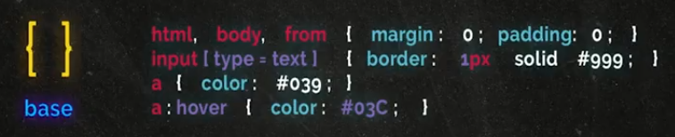
- Layout
  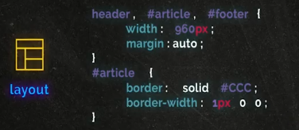
- Module
  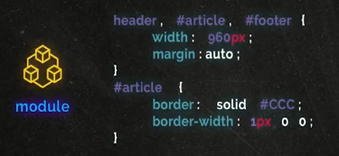
- State
  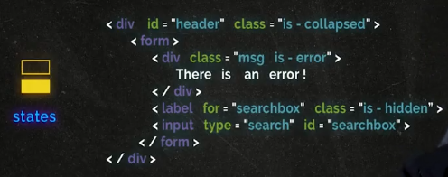
- Theme
  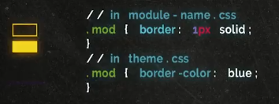

### OCSS: Orientación de objetos en CSS

OCSS o Object-Oriented CSS (Orientación de objetos en CSS).

Este se trata de un paradigma basado en la creación de objetos, que son básicamente lo que también se llama modulo o componente en otros paradigmas.

Este paradigma puede no incluir la estructura base del html Aprende a construir tu librería OCSS en esta clase.

### BEM

BEM es un paradigma que anticipa modificadores de un componente.
En esta metodología categorizamos o dividimos las clases de la siguiente manera:

**Block (Bloque)**

Los bloques consideran contenedores de los componentes que nos sirven para englobarlos tipo objetos.

  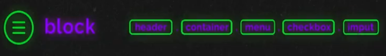

**Elements (Elementos)**

Los elementos que van dentro de estos contenedores

  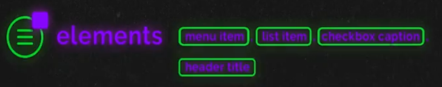

**Modifiers (modificadores)**

Son clases de lo más geniales, nos permiten modificar el comportamiento o estilo de un componente.

  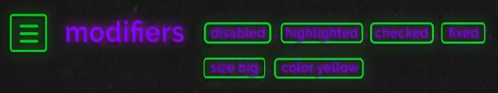

## Naming

  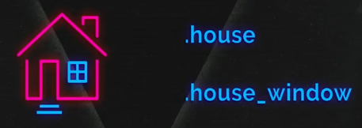

### Modificadores

Son clases que modifican el comportamiento o clase de un elemento.

  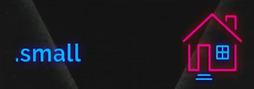

### Utilidades

Son clases que nos ayudan a generar ciertas propiedades de uso general.

  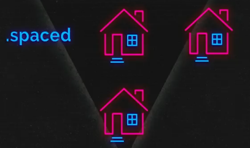

## Tokens

Nuestro objetivo es sistematizar nuestros procesos entonces nuestro sistema tiene que ser un ente configurable. En este sentido, los tokens son configuraciones que afectan a todo nuestro sistema tales como:

- Colores
- Tipografía
- Reglas de espaciado
  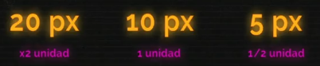
- Brakepoints

Definiremos nuestros colores basándonos en algún paradigma o en los guidelines y UI kit del producto, para definir estas variables es importante que si trabajamos con un diseñador, este también este presente y pueda verificar la viabilidad de lo que estamos haciendo.

Vamos a crear las reglas necesarias para fundamentar nuestro sistema de columnas y podremos hacer otras extras que nos permitan generar un nuevo sistema de interacción mobile. Para esto crearemos un archivo llamado brakepoints.scss

## Espaciado

Ya que tenemos elementos dentro de nuestro sistema, ahora tenemos que poner a prueba nuestros tokens de espaciado para ello crearemos un organismo para ver cuál es el efecto de nuestras reglas cuando los átomos conviven en un ecosistema de elementos.

El organismo más común de toda plataforma es el formulario que nos ayuda a recopilar información del usuario. Para esto tomaremos elementos como:

- Label
- Input
- Alert
- Btn
- Modals

## Grillas

Llegó el momento que nos pongamos rudos y definamos cómo se va a comportar nuestro sistema. Para esto necesitamos crear un sistema de columnas.

- Antes de hacerlo vamos a cuestionar si usaremos un layout al que tengamos que seguir, pues esto es bastante importante para la reglamentación de nuestro grid.
- Utilizaremos el sistema de doce columnas como lo hace Bootstrap, basados en un layout.
- Una vez definido tenemos cómo funcionan nuestras columnas, el departamento de diseño tienen que estimar cómo es que sus componentes se van a comportar y para ello este sistema les ayudara cuando estén diseñando.
- Una parte importante es que el documento de diseño como programación, siga las mismas reglas.
- Dentro de nuestro wrapper, donde definiremos el contenido construiremos los grid, podemos basarnos en librerías de grids que ya existen en internet, solo tenemos que modificar los estilos para que tengan sentido dentro de nuestro sistema.
- Hay tres cosas importantes qué definir dentro del grid de nuestro sistema:

  1. Nomenclatura de columnas
  2. Nomenclatura de los brakepoints
  3. Obtener los tokens de nuestro sistema para esta definición.

https://webdesign.tutsplus.com/tutorials/a-simple-responsive-grid-made-even-better-with-sass--cms-21540

## Componentes

Estamos listos para construir elementos y para que otros puedan construir nuevos componentes respetando el sistema de diseño. Para definir un componente necesitarás tener previamente definidos:

- Tokens
- Naming
- Modificadores o Utilities

Al construir el componente en cuestión, seguimos las buenas prácticas que venimos aprendiendo. Es importante que tengas documentado el proceso en tu librería y un espacio para definir nuevos componentes.

## Documentación

Hay que tener en cuenta que somos parte de un proceso, un proceso que empieza desde la idea de resolver un problema, se crea una herramienta y se le da al usuario. Es súper importante documentar cada elemento del sistema para que el siguiente en la construcción de esta gran fabrica de elementos le pueda ser más fácil y eficiente la construcción. También te permite anticiparte a los momentos que puede tener el que se dedique a conectar este componente y brindarle las herramientas necesarias es nuestro trabajo.

Algunos puntos importantes que tienes que definir en tu documentación dentro del sistema:

- **Titulo** El nombre del componente que viene desde el diseño del componente
- **Descripción** La descripción de por qué estamos haciendo este componente y que resuelve ## Implementación Descripción sobre cómo puedes implementar este componente en tu proyecto
- **Estados** Estados que tiene con los modificadores o utilidades y si pudiera no funcionar en otros contextos o reglas que no se hayan definido.
- **Bitacora** Donde defines que cambios a tenido el componente durante la vida del sistema

## Testing

Es muy importante definir la manera en que calificarás el éxito, cómo tendremos la capacidad de evaluar lo que diseñamos y construimos vs el usuario.

Para eso crearemos indicadores dentro del sistema que nos permitan tener esa respuesta y demuestre ante el equipo las desiciones que tomamos.

- Evaluemos el código vs Diseño
- Evaluemos el comportamiento
- Evaluemos el mobile

Para hacer estas pruebas yo recomiendo que lo puedas tener dentro de una plataforma tipo KANBAN Al final del día tu puedes definir tu lista de Testing, ésta ve de forma general la evaluación de un componente pero en tu proyecto dependiendo del producto que estas desarrollando tal vez requiera más o menos.

## Design review

Los más importante del sistema es que todos los equipos que participan en la creación de software estén alineados.
Es por esto que también tienes que evaluar cuales son los puntos buenos o malos de tu sistema y saber si necesitas una reestructura o mejorar ciertos procesos, siempre es bueno tener en mente hacia a donde vas y que quieres lograr con el sistema, pues sin un objetivo claro todos estaremos trabajando sin un objetivo común.

Algunos puntos muy importante para cuidar el trabajo en equipo son:

- Ten juntas semanales donde hables del sistema.
- Pregunta a otros departamentos si les facilita la construcción del producto.
- De no ser así media que cosas puedes hacer.
- No generes deuda técnica, los cambios y parches rápidos al final del día te vendrán a tirar el sistema.
- Ten un roadmap del sistema. Siempre trata de ser sistemático y trabaja para los demás. Todo el equipo te lo agradecerá.
- Siempre asegura que lo que imaginas se diseñe y que lo que diseñas se construya.
